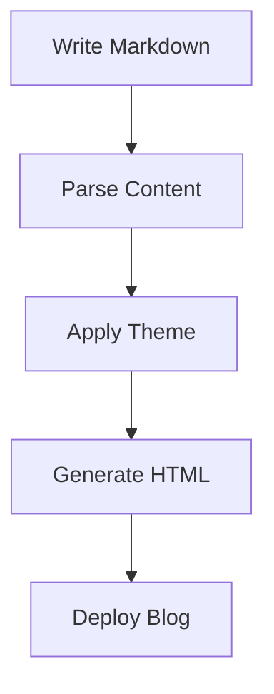
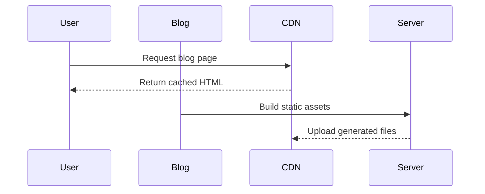

# Markdown Feature Test: Blog Rendering Showcase

This post is designed to test how a blog framework renders **standard Markdown**, _typography_, `inline code`, tables, code blocks, LaTeX math, images, diagrams, footnotes, and common extensions.

> This document intentionally includes many Markdown features in one place.  
> Use it to verify typography, spacing, syntax highlighting, theme styles, and plugin compatibility.

---

## 1. Headings

# H1 Heading

## H2 Heading

### H3 Heading

#### H4 Heading

##### H5 Heading

###### H6 Heading

---

## 2. Paragraphs and Inline Formatting

This is a normal paragraph. Markdown should preserve paragraph spacing while wrapping long lines naturally.

This sentence includes **bold text**, _italic text_, ***bold italic text***, ~~strikethrough text~~, `inline code`, and a [link to OpenAI](https://openai.com).

You can also write inline HTML if the renderer allows it:

<span style="color: crimson;">This text is styled using inline HTML.</span>

Special characters should render correctly:

- Ampersand: &
- Less than: <
- Greater than: >
- Copyright: ©
- Em dash: —
- Ellipsis: …
- Emoji: 🚀 🧠 📚

---

## 3. Blockquotes

> This is a basic blockquote.

> This is a multi-line blockquote.
>
> It contains another paragraph inside the same quote.

> Nested blockquote:
>
> > This is a nested quote.
> >
> > > This is a deeply nested quote.

---

## 4. Lists

### Unordered List

- Apple
- Banana
- Cherry
  - Sweet cherry
  - Sour cherry
    - Montmorency cherry
    - Morello cherry
- Dragon fruit

### Ordered List

1. Install dependencies
2. Write Markdown content
3. Build the site
4. Deploy the generated files

### Mixed List

1. Frontend
   - Astro
   - Hugo
   - Next.js
2. Backend
   - PostgreSQL
   - Redis
   - Go
3. Infrastructure
   - Docker
   - Kubernetes
   - Caddy

### Task List

- [x] Render headings
- [x] Render lists
- [x] Render tables
- [x] Render code blocks
- [ ] Verify dark mode styles
- [ ] Verify mobile layout

---

## 5. Horizontal Rules

Three hyphens:

---

Three asterisks:

***

Three underscores:

___

---

## 6. Links

Inline link:

[TensorChord](https://tensorchord.ai)

Reference-style link:

[VectorChord][vectorchord]

Autolink:

<https://example.com>

Email autolink:

<hello@example.com>

[vectorchord]: https://github.com/tensorchord/VectorChord

---

## 7. Images

Basic image:


Image with title:


Linked image:

[](https://example.com)

Two images side by side (OpenAI-style layout):

<div class="media-grid-2">
  <figure>
    
    <figcaption>Chart A caption</figcaption>
  </figure>
  <figure>
    
    <figcaption>Chart B caption</figcaption>
  </figure>
</div>

Optional wide image (OpenAI-style, via HTML wrapper):

<figure class="wide-media">
  
  <figcaption>This image uses <code>class="wide-media"</code> to render wider than the prose column.</figcaption>
</figure>

---

## 8. Tables

### Basic Table

| Framework | Language | Type | Markdown Support |
|---|---:|:---:|---|
| Hugo | Go | SSG | Excellent |
| Astro | TypeScript | SSG / SSR | Excellent |
| Hexo | Node.js | SSG | Excellent |
| Zola | Rust | SSG | Excellent |

### Alignment Test

| Left Aligned | Center Aligned | Right Aligned |
|:---|:---:|---:|
| left | center | right |
| text | text | text |
| 123 | 456 | 789 |

### Complex Table

| Feature | Supported | Notes |
|---|---:|---|
| **Bold text** | ✅ | Formatting inside tables |
| `Inline code` | ✅ | Useful for config names |
| [Links](https://example.com) | ✅ | Links inside cells |
| Math `$E = mc^2$` | Depends | Requires math plugin support |

Optional wide table (OpenAI-style, only when needed):

<div class="wide-table">
  <table>
    <thead>
      <tr>
        <th>Benchmark</th>
        <th>Model A</th>
        <th>Model B</th>
        <th>Model C</th>
        <th>Model D</th>
        <th>Notes</th>
      </tr>
    </thead>
    <tbody>
      <tr>
        <td>Terminal tasks</td>
        <td>82.7%</td>
        <td>75.1%</td>
        <td>69.4%</td>
        <td>68.5%</td>
        <td>Wide table with many columns</td>
      </tr>
      <tr>
        <td>Knowledge work</td>
        <td>84.9%</td>
        <td>83.0%</td>
        <td>80.3%</td>
        <td>67.3%</td>
        <td>Should remain readable on desktop</td>
      </tr>
    </tbody>
  </table>
</div>

---

## 9. Code

### Inline Code

Use `npm install`, `hugo server`, or `astro dev` to start local development.

### Fenced Code Block

```text
This is a plain text code block.
No syntax highlighting should be applied.
```

### JavaScript

```javascript
function greet(name) {
  const message = `Hello, ${name}!`;
  console.log(message);
}

greet("Markdown");
```

### TypeScript

```typescript
type BlogPost = {
  title: string;
  date: string;
  tags: string[];
  draft?: boolean;
};

const post: BlogPost = {
  title: "Markdown Feature Test",
  date: "2026-04-24",
  tags: ["markdown", "blog", "test"],
};
```

### Python

```python
from dataclasses import dataclass

@dataclass
class BlogPost:
    title: str
    date: str
    tags: list[str]

post = BlogPost(
    title="Markdown Feature Test",
    date="2026-04-24",
    tags=["markdown", "blog", "latex"],
)

print(post)
```

### Go

```go
package main

import "fmt"

func main() {
    fmt.Println("Hello, Markdown!")
}
```

### Rust

```rust
fn main() {
    let frameworks = vec!["Hugo", "Astro", "Zola", "Hexo"];

    for framework in frameworks {
        println!("Testing {}", framework);
    }
}
```

### SQL

```sql
CREATE TABLE blog_posts (
    id SERIAL PRIMARY KEY,
    title TEXT NOT NULL,
    slug TEXT UNIQUE NOT NULL,
    published_at TIMESTAMP,
    body_markdown TEXT NOT NULL
);

SELECT title, published_at
FROM blog_posts
WHERE published_at IS NOT NULL
ORDER BY published_at DESC;
```

### Bash

```bash
# Hugo
hugo server --buildDrafts

# Astro
npm create astro@latest
npm run dev

# Zola
zola serve
```

### JSON

```json
{
  "title": "Markdown Feature Test",
  "features": ["tables", "code", "math", "diagrams"],
  "draft": false
}
```

### YAML

```yaml
title: Markdown Feature Test
date: 2026-04-24
tags:
  - markdown
  - blog
  - rendering
draft: false
```

---

## 10. LaTeX Math

> Math rendering requires KaTeX, MathJax, or equivalent support.

### Inline Math

Einstein's mass-energy equivalence is $E = mc^2$.

The quadratic formula is $x = \frac{-b \pm \sqrt{b^2 - 4ac}}{2a}$.

### Block Math

$$
E = mc^2
$$

$$
\int_{-\infty}^{\infty} e^{-x^2} \, dx = \sqrt{\pi}
$$

$$
\nabla \cdot \mathbf{E} = \frac{\rho}{\varepsilon_0}
$$

### Matrix

$$
A =
\begin{bmatrix}
1 & 2 & 3 \\
4 & 5 & 6 \\
7 & 8 & 9
\end{bmatrix}
$$

### Aligned Equations

$$
\begin{aligned}
f(x) &= ax^2 + bx + c \\
f'(x) &= 2ax + b \\
f''(x) &= 2a
\end{aligned}
$$

### Probability

$$
P(A \mid B) = \frac{P(B \mid A)P(A)}{P(B)}
$$

### Summation

$$
\sum_{i=1}^{n} i = \frac{n(n+1)}{2}
$$

### Vector Similarity

Cosine similarity:

$$
\operatorname{sim}(\mathbf{a}, \mathbf{b}) =
\frac{\mathbf{a} \cdot \mathbf{b}}
{\|\mathbf{a}\| \|\mathbf{b}\|}
$$

---

## 11. Footnotes

Here is a sentence with a footnote.[^1]

Here is another footnote with more detail.[^long-note]

[^1]: This is a simple footnote.

[^long-note]: This is a longer footnote.

    It can contain multiple paragraphs and even code:

    ```text
    Footnotes may support nested Markdown depending on the renderer.
    ```

---

## 12. Definition Lists

Term 1
: Definition for term 1.

Term 2
: Definition for term 2.
: Another definition for term 2.

Markdown
: A lightweight markup language for formatting plain text.

---

## 13. Callouts / Admonitions

> [!NOTE]
> This is a note callout. GitHub-style callouts may require renderer support.

> [!TIP]
> This is a useful tip.

> [!IMPORTANT]
> This is an important message.

> [!WARNING]
> This is a warning.

> [!CAUTION]
> This is a caution message.

Some frameworks use alternative syntax:

:::note
This is a container-style note block.
:::

:::warning
This warning syntax is common in some documentation frameworks.
:::

---

## 14. Details / Summary

<details>
<summary>Click to expand</summary>

This content is hidden by default.

It can include Markdown-like content depending on your renderer:

- Item 1
- Item 2
- Item 3

```javascript
console.log("Hidden code block");
```

</details>

---

## 15. Mermaid Diagram

> Mermaid requires a Mermaid plugin or built-in support.





---

## 16. Frontend Component Placeholder

Some frameworks support MDX or component embedding.

Example MDX-style component usage:

```mdx
<Callout type="info">
  This is a custom component inside Markdown.
</Callout>

<Chart data={benchmarkData} />
```

Astro-style component usage may look like this:

```astro
---
import Hero from "../components/Hero.astro";
---

<Hero title="Markdown Test" subtitle="Testing Astro components in Markdown-like content." />
```

---

## 17. HTML Blocks

<div class="custom-card">
  <h3>Custom HTML Card</h3>
  <p>This block tests whether raw HTML is allowed in Markdown.</p>
</div>

<table>
  <thead>
    <tr>
      <th>HTML Table</th>
      <th>Value</th>
    </tr>
  </thead>
  <tbody>
    <tr>
      <td>Status</td>
      <td>Rendered</td>
    </tr>
  </tbody>
</table>

---

## 18. Escaping Characters

Use a backslash to escape Markdown syntax:

\*This should not be italic.\*

\# This should not be a heading.

\`This should not be inline code.\`

Escaped pipe in table:

| Syntax | Output |
|---|---|
| `a \| b` | a \| b |

---

## 19. Typography Stress Test

### Long Paragraph

Lorem ipsum dolor sit amet, consectetur adipiscing elit. Integer vehicula, magna non dictum mattis, neque justo porttitor nibh, a tincidunt urna ipsum non sapien. Suspendisse potenti. Donec id feugiat justo. Sed luctus, libero sed dignissim sagittis, risus massa porttitor nunc, vitae efficitur justo ante eget turpis.

### Long Inline Code

This paragraph contains a very long inline code segment: `SELECT id, title, slug, published_at, author_id, category_id, created_at, updated_at FROM blog_posts WHERE published_at IS NOT NULL ORDER BY published_at DESC LIMIT 100;`

### Long URL

https://example.com/this/is/a/very/long/url/that/should/wrap/properly/in/the/blog/layout/without/breaking/the/container/or/causing/horizontal/scrolling

---

## 20. Blog Content Example

### Building a Markdown-first Blog

A Markdown-first blog has several advantages:

1. Content is stored as plain text.
2. Git can track every change.
3. Articles can be reviewed through pull requests.
4. The same content can be reused across static sites, docs, newsletters, and archives.

For example, a typical blog repository may look like this:

```text
blog/
├── content/
│   ├── posts/
│   │   ├── markdown-feature-test.md
│   │   └── release-notes.md
│   └── pages/
│       └── about.md
├── themes/
├── static/
├── config.toml
└── package.json
```

A good blog theme should support:

- readable typography
- dark mode
- responsive layout
- code highlighting
- image captions
- math rendering
- RSS feed
- Open Graph metadata
- SEO-friendly URLs

---

## 21. Image Caption Pattern

Markdown itself does not define image captions, but many themes support figure syntax using HTML:

<figure>
  
  <figcaption>Figure 1: A placeholder image with a caption.</figcaption>
</figure>

---

## 22. Table of Contents Test

This document contains many headings. A blog framework may generate a table of contents automatically from heading levels.

Expected TOC behavior:

- Include H2 and H3 headings.
- Ignore H1 except page title.
- Preserve anchor links.
- Handle duplicate headings.
- Handle special characters in headings.

### Duplicate Heading

First duplicate heading.

### Duplicate Heading

Second duplicate heading.

### Heading with `inline code`

Testing anchors with inline code.

### Heading with 中文字符

测试中文标题的锚点生成。

### Heading with emoji 🚀

Testing emoji in heading anchors.

---

## 23. Internationalization Text

English: This is a Markdown rendering test.

中文：这是一个 Markdown 渲染测试。

日本語：これは Markdown レンダリングのテストです。

한국어: 이것은 Markdown 렌더링 테스트입니다.

Русский: Это тест рендеринга Markdown.

العربية: هذا اختبار لعرض Markdown.

---

## 24. Checklist for Blog Renderer

- [x] Frontmatter parsed correctly
- [ ] Headings styled correctly
- [ ] TOC generated correctly
- [ ] Code highlighting works
- [ ] Inline code does not break layout
- [ ] Tables are responsive
- [ ] Images are responsive
- [ ] Math renders correctly
- [ ] Footnotes render correctly
- [ ] Mermaid diagrams render correctly
- [ ] Callouts render correctly
- [ ] Raw HTML is handled safely
- [ ] RSS metadata works
- [ ] Open Graph metadata works
- [ ] Dark mode works
- [ ] Mobile layout works

---

## 25. Final Math and Code Stress Test

Inline math next to code: The value of `$x$` in `const x = 42` should not conflict with math rendering.

Block math after code:

```python
def square(x: float) -> float:
    return x * x
```

$$
\text{square}(x) = x^2
$$

Code after math:

$$
\lim_{n \to \infty} \left(1 + \frac{1}{n}\right)^n = e
$$

```typescript
const eApprox = Math.pow(1 + 1 / 1_000_000, 1_000_000);
console.log(eApprox);
```

---

## Conclusion

If all sections above render correctly, your blog framework has solid support for:

- Standard Markdown
- GitHub Flavored Markdown
- Syntax highlighting
- Tables
- Footnotes
- LaTeX math
- Mermaid diagrams
- HTML blocks
- Callouts
- Responsive content
- Long-form technical writing

This makes it suitable for technical blogs, engineering documentation, release notes, and research-style articles.
